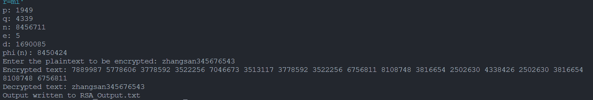
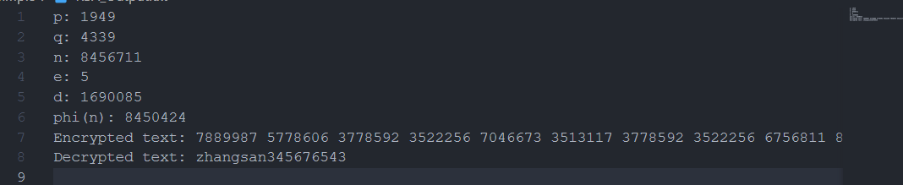
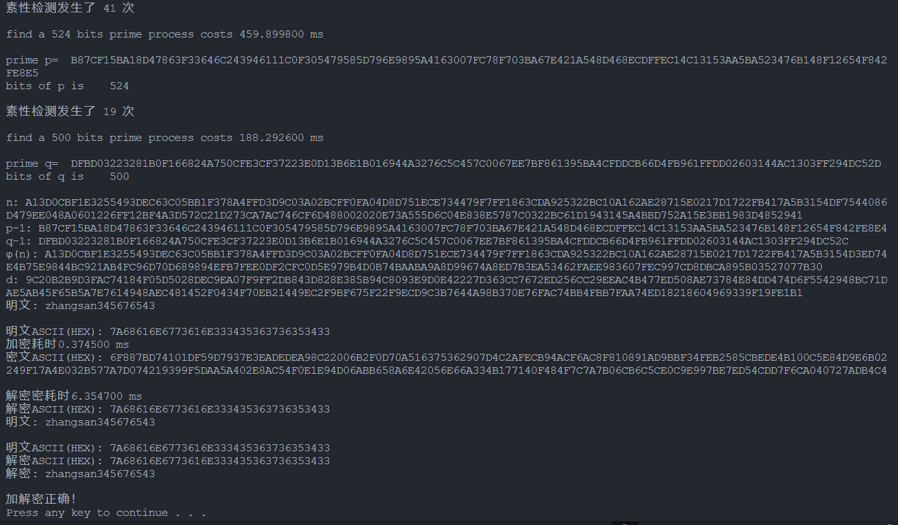
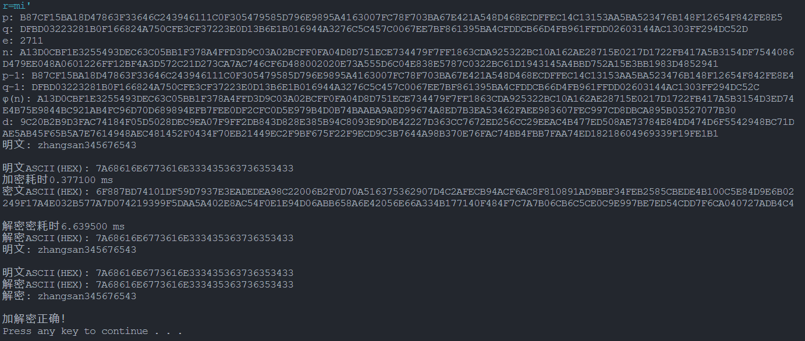

# 上机8-RSA密码算法实现

## 一、C++实现RSA算法

[simple](simple)目录下

### 结果输出：

### 保存到文件：

## 二、1024位RSA算法

[RSA1024](RSA1024)目录下

详见*[Reference](https://github.com/DXWEIE/RSA-and-large-number-operation "GitHub")*

### 结果输出：

生成p和q

利用上次生成的p和q

